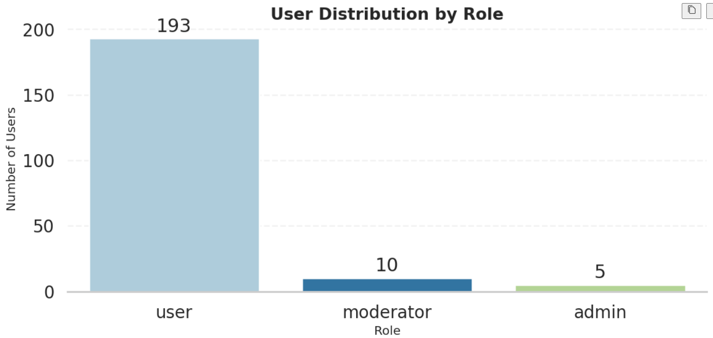
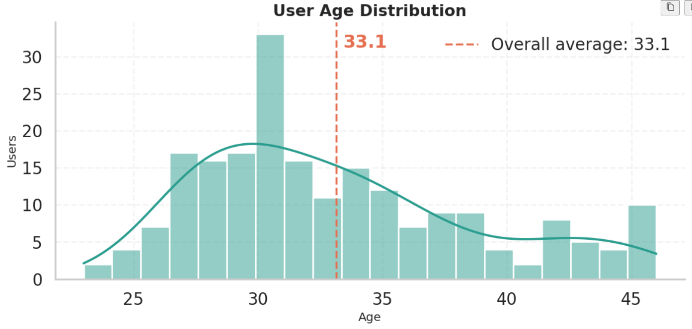
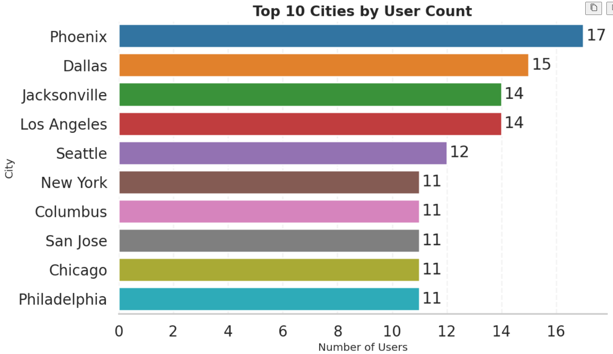

# USERS DATA: FROM API TO EXPLORATORY DATA ANALYSIS

A Python project that pulls user data from the DummyJSON API, cleans and explores it with Pandas, and produces professional, theme-consistent visualizations using Seaborn and Matplotlib.

## Project Overview
The notebook `api_to_eda.ipynb` demonstrates a complete workflow:
1. Fetch paginated API data.
2. Flatten nested JSON into a tabular DataFrame.
3. Explore data types, missing values, and category distributions.
4. Clean key numeric columns (`age`, `height`, `weight`).
5. Build a consistent set of EDA visuals with a unified styling theme.

## 1) Fetching and Handling API Data
- Uses pagination (`limit` + `skip`) in a loop to retrieve all available users.
- Applies a browser-like `User-Agent` header via `storage_options`.
- Flattens nested JSON objects using `pd.json_normalize()`.

## 2) Data Exploration
- Inspects columns, data types, and missing values.
- Uses `describe()` for numeric summaries.
- Checks category counts for fields like `gender`, `bloodGroup`, `role`, and `address.country`.

## 3) Data Cleaning
- Focuses on numeric quality for EDA.
- Fills missing values in `age`, `height`, and `weight` using median imputation.
- Verifies final numeric dtypes before visualization.

## 4) Visualization (Unified Professional Theme)
All charts share one style configuration (grid, typography, spacing, and color system), with explicit category coloring for readability.

Current visualization flow in the notebook:
1. Number of users by gender
2. Blood group distribution
3. User role distribution
4. Top 10 cities by user count
5. Age distribution with overall average marker
6. Age spread by gender (boxplot)
7. Height distribution with overall average marker
8. Weight distribution with overall average marker
9. Correlation heatmap (`age`, `height`, `weight`)
10. Multi-variable scatter: age vs. height (bubble size = weight, hue = gender)

## Sample Visuals
### User Distribution by Role

### Age Distribution

### Top 10 Cities by User Count

### Blood Group Distribution

## Requirements
- pandas
- seaborn
- matplotlib

## Run
Open and run `api_to_eda.ipynb` from top to bottom to reproduce the full pipeline and all visuals.
